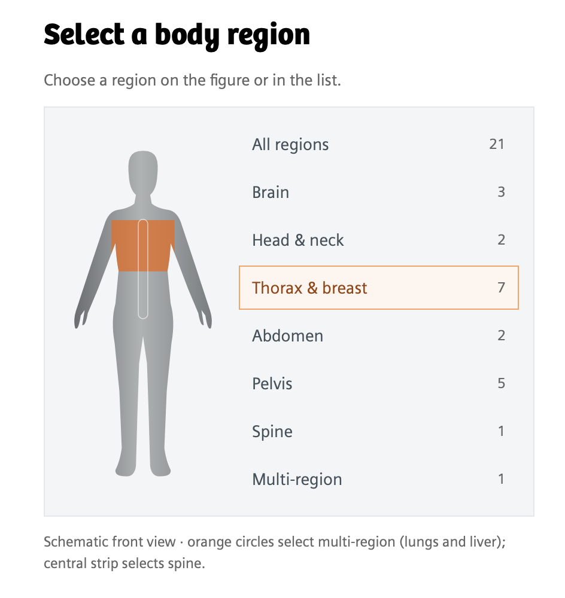
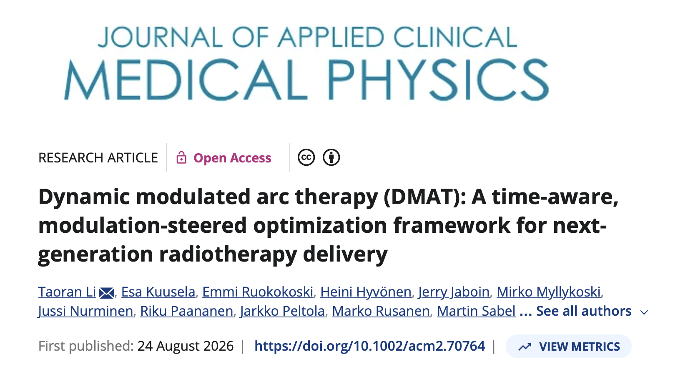

# NeoArc (DMAT) Case Library

**510(k) pending. Not available for sale in any market and no guarantee of commercialization or feature availability.**

**[Explore the NeoArc (DMAT) Case Library →](https://varian-medicalaffairsappliedsolutions.github.io/dmat-case-library/index.html)**

  

This repository stores the webpages and supporting assets in [`docs/`](docs/) for publication through **GitHub Pages (`github.io`)** as the NeoArc (DMAT) Case Library. The website is an interactive educational showcase of **NeoArc (DMAT), or Dynamic Modulated Arc Therapy** capabilities and the **time–quality navigation** concept across different anatomical sites and planning scenarios. The reports bring together dose distributions, dose–volume histograms (DVHs), selected dosimetric endpoints, and delivery-time information to make planning trade-offs easier to explore.

**For education and demonstration only. Not intended for clinical use or clinical decision-making.**

## Scientific reference

[Dynamic modulated arc therapy (DMAT): A time-aware, modulation-steered optimization framework for next-generation radiotherapy delivery](https://aapm.onlinelibrary.wiley.com/doi/abs/10.1002/acm2.70764). *Journal of Applied Clinical Medical Physics*. 2026;27(9):e70764. DOI: [10.1002/acm2.70764](https://doi.org/10.1002/acm2.70764).

## Exploring time–quality navigation

On the [published website](https://varian-medicalaffairsappliedsolutions.github.io/dmat-case-library/index.html), start with the case library index and select an anatomical site. Within a report:

1. Review the case overview, prescription, planning setup, and reference plans.
2. Compare synchronized dose-colorwash slices across the available modulation levels.
3. Explore quality–time plots and individual endpoints to see how the displayed dosimetric measures vary with delivery time.
4. Toggle plans and structures in the DVH comparison to inspect coverage and organ-at-risk dose.
5. Where available, use **Plan in motion** to view an illustrative delivery animation.

## Disclaimers and limitations

For education and demonstration only. Not intended for clinical use or clinical decision-making.

This library showcases the technical capabilities of the NeoArc (DMAT) algorithm. It makes no claim of clinical value, clinical benefit, or improved patient outcomes. Some results shown were generated using non-clinical algorithm versions.

Products or features shown may not be commercially available. Availability varies by country, and future availability or commercialization is not guaranteed.

Results reflect the specific planning data, configurations, and evaluation methods shown; results in other settings may differ. These examples do not establish clinical safety, effectiveness, or superiority.

**510(k) pending. Not available for sale in any market and no guarantee of commercialization or feature availability.**

For demonstration only. Does not reflect actual machine specifications, dimensions, or delivered treatment.

Illustrative only. The machine visualization is based on publicly available data and does not represent actual machine specifications or dimensions.

Lightweight viewer: dose grid and accumulation caches omitted; accumulation disabled.

## Third-party components

The delivery viewers include third-party components with their own copyright notices and license terms. See the `THIRD-PARTY-NOTICES.txt` and `licenses/` files within each `delivery-viewer` directory under `docs/`. Those notices and terms remain applicable.
